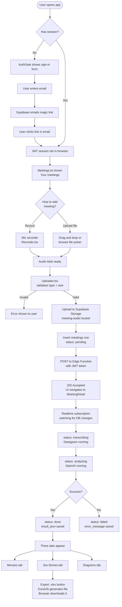
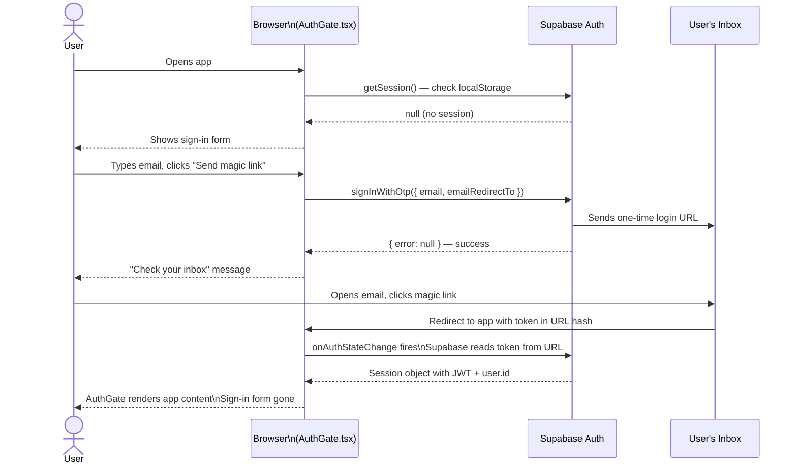
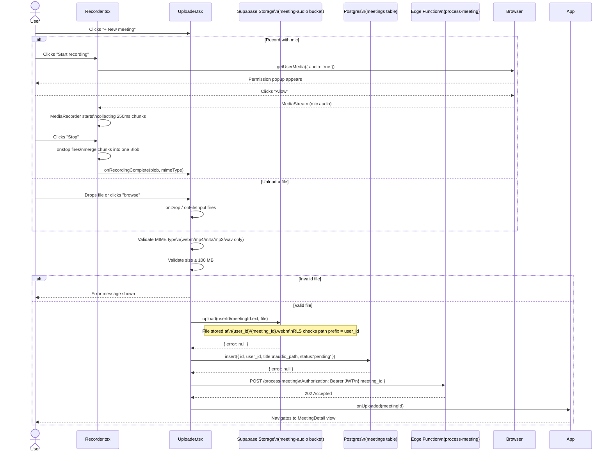
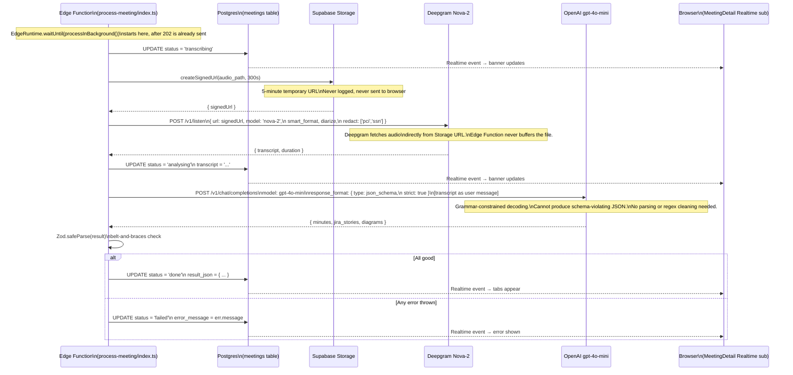
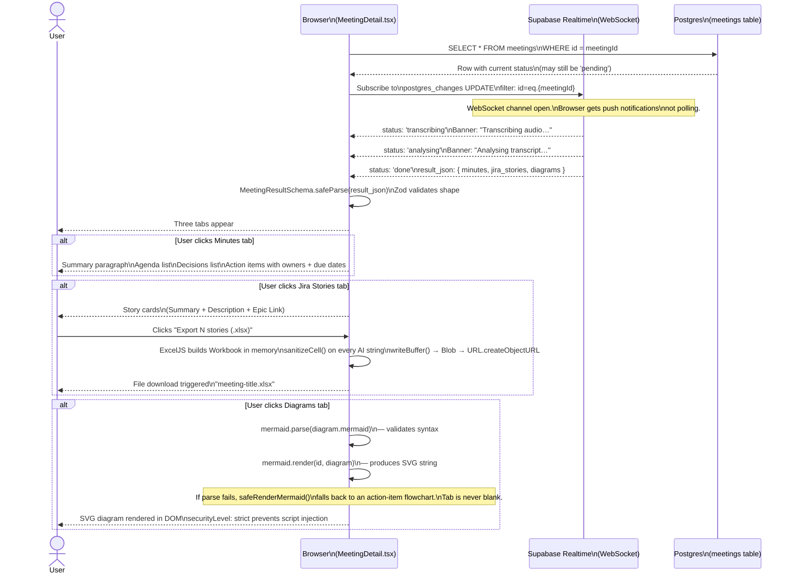

# MeetAssist — User Journey Diagrams

Five diagrams covering the complete user experience: sign-in, capture, pipeline, results, and the full end-to-end view.

---

## 1. Full end-to-end overview

The happy path from opening the app to downloading a Jira export.

---

## 2. Sign-in journey

How the user gets a session — magic link, no password.

---

## 3. Capture journey

Recording with the mic vs. uploading a file — both end up at the same upload step.

---

## 4. Background pipeline journey

What happens inside the Edge Function after the 202 response is sent.
The user's browser never waits for this — it watches via Realtime instead.

---

## 5. Results journey

How the browser receives updates and renders the three output tabs.

---

## Reading guide

| Diagram | What it answers |
|---|---|
| **1 — Overview** | "What does the app do from start to finish?" |
| **2 — Sign-in** | "How does the magic-link auth flow work?" |
| **3 — Capture** | "What happens when I record or upload a file?" |
| **4 — Pipeline** | "What does the server do after I submit a meeting?" |
| **5 — Results** | "How do the results appear without me refreshing the page?" |
